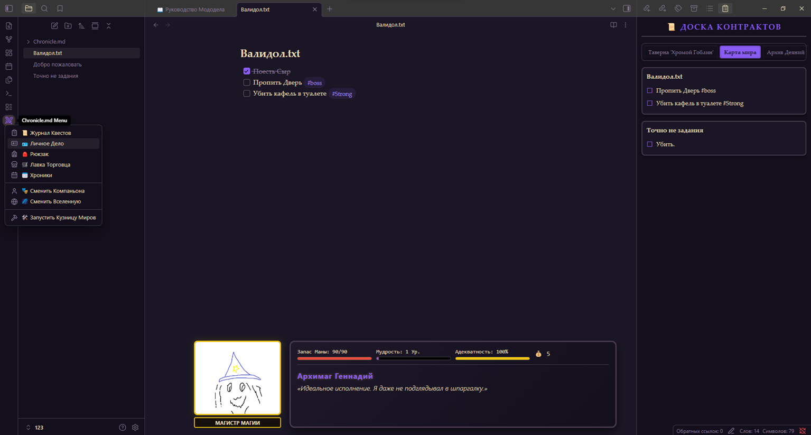
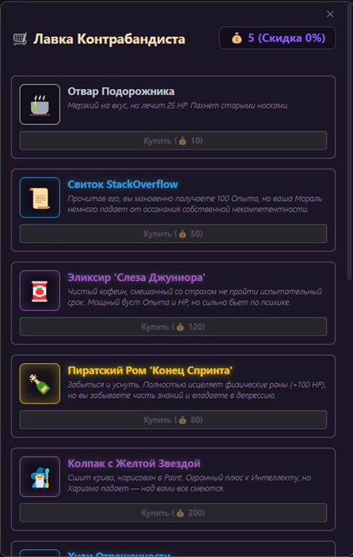
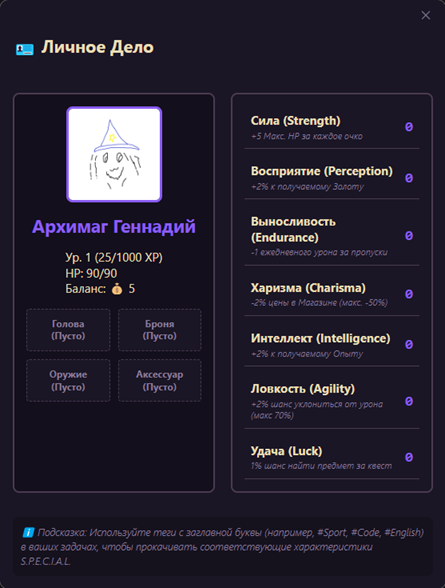
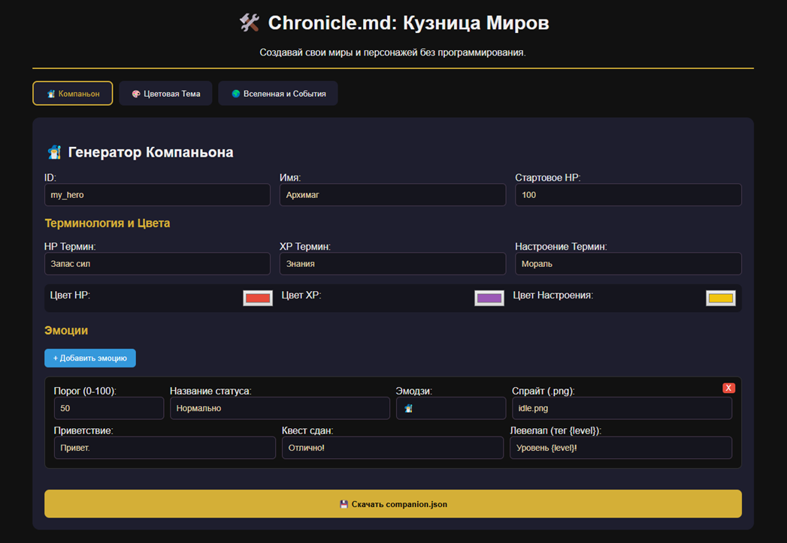

# ⚔️ Chronicle.md для Obsidian
**Превратите свою рутину в эпическое приключение!**

Chronicle.md — это не просто трекер задач, это полноценный ролевой движок, встроенный прямо в ваше хранилище Obsidian. Выполняйте задачи, получайте опыт, прокачивайте статы S.P.E.C.I.A.L., открывайте лутбоксы и сражайтесь с выгоранием!

---

## 🌟 Ключевые особенности

* **Создание задачи:** `- [ ] задача #тег(необязателен)` стандартные теги задаются в параметрах вселенной!

### 🛡️ Геймификация рутины
* **Награды:** Выполнение задач (`- [x]`) дает вам Опыт (XP) и Золото.
* **Выживание:** За каждый пропущенный день (когда вы ничего не делали) вы теряете HP. Упадет до нуля — потеряете часть накопленного опыта и золота!
* **Настроение:** Компаньон реагирует на ваши действия. Сбросили галочку с задачи? Настроение упадет, а напарник выскажет недовольство.

### 🧬 Система S.P.E.C.I.A.L.
Плагин читает ваши теги! Используйте теги с заглавной буквы, чтобы качать нужные характеристики:
* `#Sport` качает **S** (Силу) → +5 Макс. HP.
* `#Perception` качает **P** (Восприятие) → +2% к добыче золота.
* `#English` качает **E** (Выносливость) → Снижает урон за пропущенные дни.
* `#Code` качает **C** (Харизму) → Скидки в магазине.
* `#Idea` качает **I** (Интеллект) → +2% к получаемому Опыту.
* `#Agility` качает **A** (Ловкость) → Шанс полностью уклониться от урона.
* `#Luck` качает **L** (Удачу) → Шанс найти предмет за выполненный квест.

### 🎒 Полноценный Инвентарь и Экипировка
Тратьте золото в "Лавке Торговца". Покупайте зелья, чтобы восстановить здоровье, или экипировку, чтобы получить мощные бонусы к статам. 
*(Да, здесь есть Гача! Покупайте лутбоксы разной редкости и испытывайте удачу).*

### 🎲 Случайные События (Encounters)
Выполнение задач может триггерить случайные текстовые квесты. Выбор за вами: помочь раненому торговцу (потеряв золото, но получив мораль) или пройти мимо?

---

## 🌌 Мультивселенная и Моддинг (Data-Driven)
Chronicle.md построен так, что **абсолютно всё** (от названий статов до цветов интерфейса) настраивается без программирования. 

Плагин поддерживает **Мультивселенные** и разных **Компаньонов**. Сегодня вы Архимаг в фэнтези мире, а завтра — Киборг в киберпанке. Инвентарь, сохранения и статы у каждого компаньона свои!

### 🛠️ "Кузница Миров" (Встроенный Mod Maker)
Вам не нужно писать JSON-код руками! Вместе с плагином идет `🛠️ Кузница Миров.html`. 
1. Нажмите на иконку плагина в Obsidian.
2. Выберите "Запустить Кузницу Миров" (откроется в браузере).
3. Создавайте предметы, пишите диалоги, настраивайте шансы дропа и перекрашивайте интерфейс мышкой!

 

---

## 📥 Установка

1. Скачайте последний релиз (`chronicle-md.zip`) со страницы Releases.
2. Распакуйте папку `chronicle-md` в директорию вашего хранилища: `.obsidian/plugins/`.
3. Перезапустите Obsidian (или обновите список плагинов).
4. Включите **Chronicle.md** в настройках.
5. *При первом запуске плагин автоматически создаст папку `Chronicle.md` с руководством и Кузницей!*

---

## 🏗️ Архитектура (Для гиков)
* **Local-First:** Никаких серверов и облаков. Все ваши статы и сохранения лежат в локальном `data.json`.
* **Graceful Degradation:** Если вы не нарисовали `.png` спрайты для предметов или компаньонов — не беда. Плагин автоматически и бесшовно переключится на крупный рендер эмодзи!
* **Global Asset Registry:** Предметы могут свободно путешествовать между вселенными вместе с персонажем.

---

**Авторы:**
Создано с любовью к RPG и продуктивности: **JohnOne** & **Gemini-3.1pro**.
Художник: *Mouse* **Aruakki**